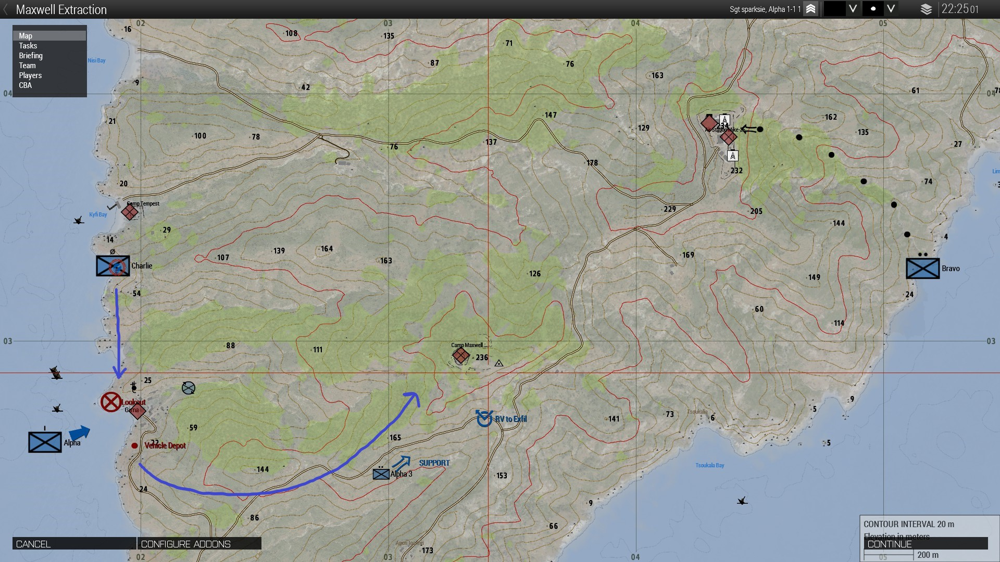

# [CO-OP] Maxwell Extraction

(WIP)

A co-op night operation set on Stratis, for up to a fireteam-strength group of players.

A POW is held at Camp Maxwell, and your primary objective is to safely extract him while OPFOR is occupied by a surprise BLUFOR offensive. Prepare a nearby town for BLUFOR landing, draw reinforcements away from the Camp, and work quickly and quietly to minimize enemy resistance and ensure the survival of your squad and the POW.

## Requirements
- [Ace3](https://ace3mod.com/)
    - Required for interactions/state of the POW. A non-ACE version might be made in the future.

## Installation
(PLACEHOLDER - Better instructions in the future)

For a dedicated server: Place or `git clone` this repo into your server's ~/mpmissions directory

For a listen/client-hosted server: Place or `git clone` this repo into your PROFILE's /mpmissions directory. On Windows, this will probably look something like 
```
C:\users\<win-username>\Documents\Arma 3\mpmissions
```
OR
```
C:\users\<win-username>\Documents\Arma 3 - Other Profiles\<username>\mpmissions
```

## Map

